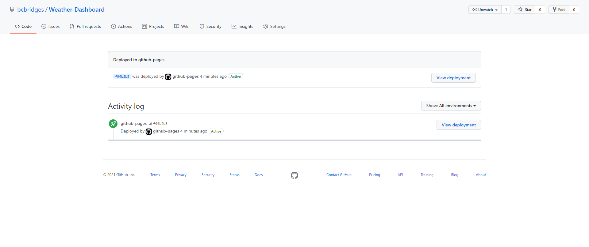

# [Weather-Dashboard](https://bcbridges.github.io/Weather-Dashboard/) Website

## Description of Project

This project was developed to practice utilizing jQuery, Bootstrap, and fetching 3rd-party API information. Its main purpose is to provide accurate up-to-date weather information for searched locations. The default location upon entry is Denver, Colorado.

### script.js

- The JavaScript in this project utilized jQuery to minimize the amount of code required.
- Comments have been inserted above each function to describe its purpose.
- Two endpoints are fetched during the searching funtions, and both call to the [OpenWeather API](https://openweathermap.org/).

## Installation and Access

There is no required software installation necessary to access the code or GitHub published webpage. To access the webpage, either click the 'Weather-Dashboard' link at the top of this readme or go to this link https://bcbridges.github.io/Weather-Dashboard/. If accessing manually through the repository, click on the 'github-pages' link under the environments. From here, you can click on the version history of the website that you would like to see - Image 1.

### Image 1

The index.html can be accessed [here](index.html), the style.css [here](./assets/style.css), and the script.js [here](./assets/script.js).

## License

Copyright (C) 2021 Brice Bridges - the full license can be viewed [here](license.txt)
